R Markdown EDA Milestone
================

## R Markdown

This is an R Markdown document. Markdown is a simple formatting syntax
for authoring HTML, PDF, and MS Word documents. For more details on
using R Markdown see <http://rmarkdown.rstudio.com>.

\_\_\_\_\_\_\_\_\_\_\_\_\_\_\_\_\_\_\_\_\_\_\_\_\_\_\_\_\_\_\_\_\_\_\_\_\_\_\_\_\_\_\_\_\_\_\_\_\_\_\_\_\_\_\_\_\_\_\_\_\_\_\_\_\_\_\_\_\_\_\_\_\_\_

> Data Preperation for Diamonds Data Set:

``` r
# Download tidyverse library 
library(tidyverse)
```

    ## ── Attaching core tidyverse packages ──────────────────────── tidyverse 2.0.0 ──
    ## ✔ dplyr     1.1.4     ✔ readr     2.1.5
    ## ✔ forcats   1.0.0     ✔ stringr   1.5.1
    ## ✔ ggplot2   3.5.2     ✔ tibble    3.2.1
    ## ✔ lubridate 1.9.4     ✔ tidyr     1.3.1
    ## ✔ purrr     1.0.4     
    ## ── Conflicts ────────────────────────────────────────── tidyverse_conflicts() ──
    ## ✖ dplyr::filter() masks stats::filter()
    ## ✖ dplyr::lag()    masks stats::lag()
    ## ℹ Use the conflicted package (<http://conflicted.r-lib.org/>) to force all conflicts to become errors

``` r
#load and inspect data
library(ggplot2)
data(diamonds)
#str(diamonds)
summary(diamonds)
```

    ##      carat               cut        color        clarity          depth      
    ##  Min.   :0.2000   Fair     : 1610   D: 6775   SI1    :13065   Min.   :43.00  
    ##  1st Qu.:0.4000   Good     : 4906   E: 9797   VS2    :12258   1st Qu.:61.00  
    ##  Median :0.7000   Very Good:12082   F: 9542   SI2    : 9194   Median :61.80  
    ##  Mean   :0.7979   Premium  :13791   G:11292   VS1    : 8171   Mean   :61.75  
    ##  3rd Qu.:1.0400   Ideal    :21551   H: 8304   VVS2   : 5066   3rd Qu.:62.50  
    ##  Max.   :5.0100                     I: 5422   VVS1   : 3655   Max.   :79.00  
    ##                                     J: 2808   (Other): 2531                  
    ##      table           price             x                y         
    ##  Min.   :43.00   Min.   :  326   Min.   : 0.000   Min.   : 0.000  
    ##  1st Qu.:56.00   1st Qu.:  950   1st Qu.: 4.710   1st Qu.: 4.720  
    ##  Median :57.00   Median : 2401   Median : 5.700   Median : 5.710  
    ##  Mean   :57.46   Mean   : 3933   Mean   : 5.731   Mean   : 5.735  
    ##  3rd Qu.:59.00   3rd Qu.: 5324   3rd Qu.: 6.540   3rd Qu.: 6.540  
    ##  Max.   :95.00   Max.   :18823   Max.   :10.740   Max.   :58.900  
    ##                                                                   
    ##        z         
    ##  Min.   : 0.000  
    ##  1st Qu.: 2.910  
    ##  Median : 3.530  
    ##  Mean   : 3.539  
    ##  3rd Qu.: 4.040  
    ##  Max.   :31.800  
    ## 

``` r
#head(diamonds)
```

\_\_\_\_\_\_\_\_\_\_\_\_\_\_\_\_\_\_\_\_\_\_\_\_\_\_\_\_\_\_\_\_\_\_\_\_\_\_\_\_\_\_\_\_\_\_\_\_\_\_\_\_\_\_\_\_\_\_\_\_\_\_\_\_\_\_\_\_\_\_\_\_\_\_\_\_

# 10.3.3 Exercises:

**1.) Explore the distribution of each of the x, y, and z variables in
diamonds. What do you learn? Think about a diamond and how you might
decide which dimension is the length, width, and depth.**

<u>Graphs of Distributions of X, Y, and Z variables:</u>

``` r
# Distribution of x variable

ggplot(diamonds, aes(x = x)) +
  geom_histogram(binwidth = 0.1, fill = "skyblue", color = "black") +
  ggtitle("Distribution of x")
```

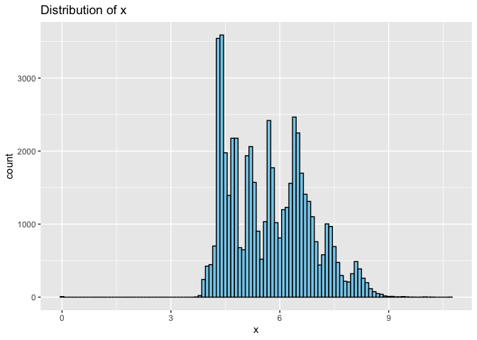<!-- -->

``` r
# Distribution of y
ggplot(diamonds, aes(x = y)) +
  geom_histogram(binwidth = 0.1, fill = "lightgreen", color = "black") +
  ggtitle("Distribution of y") +
  xlab("y (mm)") + ylab("Count") +
  xlim(0, 10)  # Limit the x-axis to range from 0 to 10
```

    ## Warning: Removed 5 rows containing non-finite outside the scale range
    ## (`stat_bin()`).

    ## Warning: Removed 2 rows containing missing values or values outside the scale range
    ## (`geom_bar()`).

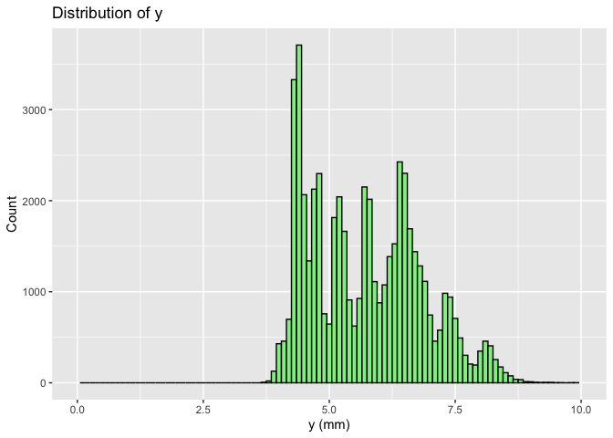<!-- -->

``` r
ggplot(diamonds, aes(x = z)) +
  geom_histogram(binwidth = 0.1, fill = "salmon", color = "black") +  # Create histogram with specified binwidth and colors
  ggtitle("Distribution of z") +  # Add title to the plot
  xlab("z (mm)") + ylab("Count") +  # Label the x and y axes
  coord_cartesian(xlim = c(0, 10))
```

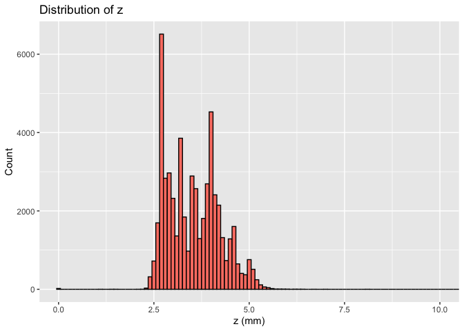<!-- -->

<u>What do I learn:</u>

All three distributions are right skew, with a concentration around the
smaller dimensions. The distributions of X and Y are similar
(~4.25,~9.0) while Z has a smaller average dimension and a slightly
tighter spread with a range around (~2.3,~5.4).

<u>Deciding Dimensions:</u>

The two longer and nearly identically distributed dimensions (x and y)
are likely width and length while the shorter and tighter distributed
dimension is likely and intuitively depth.

**2.) Explore the distribution of price. Do you discover anything
unusual or surprising? (Hint: Carefully think about the binwidth and
make sure you try a wide range of values.)**

``` r
# Create a histogram of the 'price' variable
ggplot(diamonds, aes(x = price)) +
  geom_histogram(binwidth = 25, fill = "salmon", color = "black") +
  ggtitle("Distribution of Diamond Price") +
  xlab("Price (USD)") + ylab("Count")
```

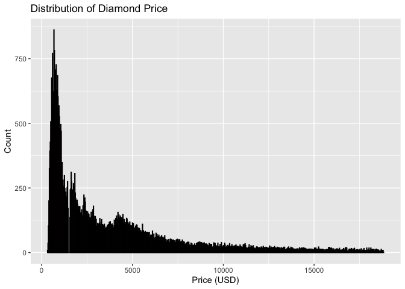<!-- -->

<u>Discoveries:</u>

There seems to be a weird and significant gap in distribution of prices
around ~1800 USD, as well as a small spike around ~4000 USD. The
distribution is also extremely right skewed with a concentration around
~1000 USD.

**3.) How many diamonds are 0.99 carat? How many are 1 carat? What do
you think is the cause of the difference?**

``` r
# Count diamonds with 0.99 carat
count_0.99 <- sum(diamonds$carat == 0.99)

# Count diamonds with 1 carat
count_1 <- sum(diamonds$carat == 1)

# Output the results
count_0.99
```

    ## [1] 23

``` r
count_1
```

    ## [1] 1558

<u>Analysis of Carat counts:</u>

There are 23 diamonds that are 0.99 carat, and 1558 diamonds that are
one 1.0 carat. This significant difference is likely due to rounding
conventions and psychological marketing tactics. 1 carat may be seen as
a milestone size, so people may consider the difference in value of 1
carat and 0.99 carats as more significant than it really is, and thus
unwilling to pay fair value for a 0.99 carat diamond.

**4.) Compare and contrast coord_cartesian() vs. xlim() or ylim() when
zooming in on a histogram. What happens if you leave binwidth unset?
What happens if you try and zoom so only half a bar shows?**

#### 

<u>*Plots with zooms of Price Distribution from (1700, 2100):*</u>

``` r
#Coord_Cartesian() zoom
ggplot(diamonds, aes(x = price)) +
  geom_histogram(binwidth = 10, fill = "salmon", color = "black") +
  ggtitle("Coord_Cartesian Zoom: Price (1700, 2100)") +
  coord_cartesian(xlim = c(1700, 2100))  # Zoom into the price range 1700 to 2100
```

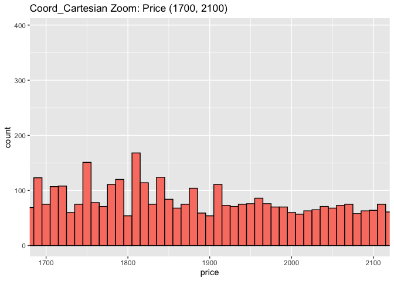<!-- -->

``` r
ggplot(diamonds, aes(x = price)) +
  geom_histogram(binwidth = 10, fill = "salmon", color = "black") +
  ggtitle("Xlim() Zoomed-in Price, bin width left unset") +
  xlim(1700, 2100)  # Remove data outside the price range 1700 to 2100
```

    ## Warning: Removed 50660 rows containing non-finite outside the scale range
    ## (`stat_bin()`).

    ## Warning: Removed 2 rows containing missing values or values outside the scale range
    ## (`geom_bar()`).

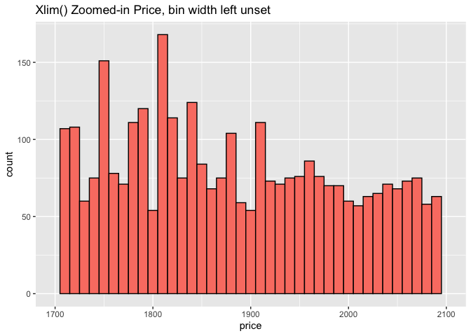<!-- -->

#### 

<u>*Plots with zooms of Price Distribution from (1700, 2100) with
bin-width left unset:*</u>

``` r
#Coord_Cartesian() zoom w/o binwidth
ggplot(diamonds, aes(x = price)) +
  geom_histogram(binwidth = , fill = "salmon", color = "black") +
  ggtitle("Coord_Cartesian Zoom, bin-width left unset:") +
  coord_cartesian(xlim = c(1700, 2100))  # Zoom into the price range 1700 to 2100
```

    ## `stat_bin()` using `bins = 30`. Pick better value with `binwidth`.

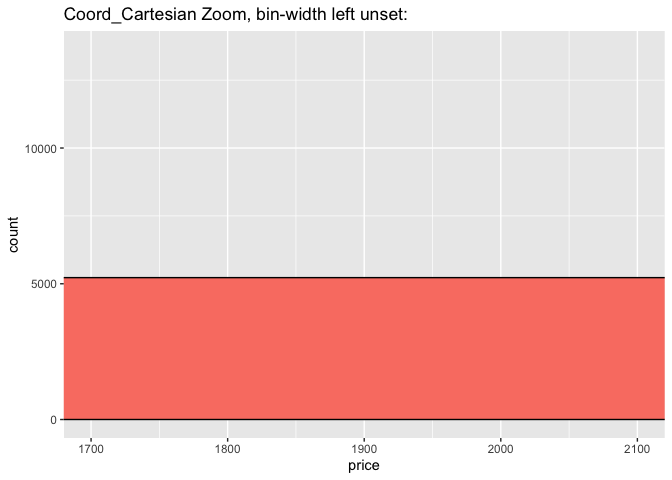<!-- -->

``` r
ggplot(diamonds, aes(x = price)) +
  geom_histogram(binwidth = , fill = "salmon", color = "black") +
  ggtitle("Xlim() Zoomed-in Price, bin width left unset") +
  xlim(1700, 2100)  # Remove data outside the price range 1700 to 2100
```

    ## `stat_bin()` using `bins = 30`. Pick better value with `binwidth`.

    ## Warning: Removed 50660 rows containing non-finite outside the scale range
    ## (`stat_bin()`).

    ## Warning: Removed 2 rows containing missing values or values outside the scale range
    ## (`geom_bar()`).

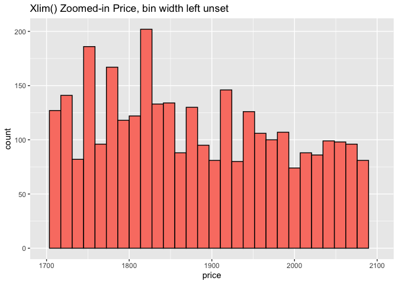<!-- -->

<u>Plots with Zooms of Price Distribution to a Partial Bar:</u>

``` r
#Coord_Cartesian() zoom to half bar
ggplot(diamonds, aes(x = price)) +
  geom_histogram(binwidth = 20, fill = "salmon", color = "black") +
  ggtitle("Coord_Cartesian Zoom, partial bar:") +
  coord_cartesian(xlim = c(1700, 1705))  # Zoom into the price range 1700 to 2100
```

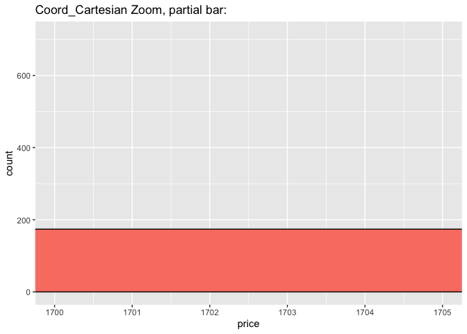<!-- -->

``` r
ggplot(diamonds, aes(x = price)) +
  geom_histogram(binwidth = 20, fill = "salmon", color = "black") +
  ggtitle("Xlim() Zoomed-in Price, partial bar?") +
  xlim(1700, 1705) 
```

    ## Warning: Removed 53918 rows containing non-finite outside the scale range
    ## (`stat_bin()`).

    ## Warning: Removed 1 row containing missing values or values outside the scale range
    ## (`geom_bar()`).

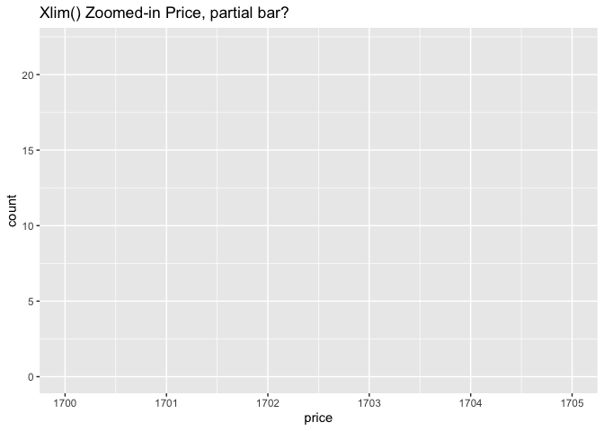<!-- -->

<u>Analysis:</u>

Coord_Cartesian() allows you to zoom in without modfying or removing any
data points, while xlim() or ylim() restrict and filter the data that is
plotted to only the section specified. This means the scale of the plot
is changed to fit the smaller “zoomed” section.

<u>Bin-width Unset:</u>

If you leave binwidth unset ggplot2 automatically selects an
“appropriate” bin size. However, this means with Coord_Cartesian the bin
size will likely be too large for the plot \[not an issue with xlim() or
ylim()…\].

<u>Zooming to half a bar:</u>

If you try and zoom so only half a bar shows, Coord_Cartesian will show
the truncated or partial bar (within the zoom of the larger plot) while
xlim() or ylim() will show a blank chart in the specified range.

\_\_\_\_\_\_\_\_\_\_\_\_\_\_\_\_\_\_\_\_\_\_\_\_\_\_\_\_\_\_\_\_\_\_\_\_\_\_\_\_\_\_\_\_\_\_\_\_\_\_\_\_\_\_\_\_\_\_\_\_\_\_\_\_\_\_\_\_\_\_\_\_\_

# 10.4.1 Exercises:

**1.) What happens to missing values in a histogram? What happens to
missing values in a bar chart? Why is there a difference in how missing
values are handled in histograms and bar charts?**

<u>Change 10% of Price Values to Missing:</u>

``` r
set.seed(123)

# Introduce missing values in the 'clarity' column by randomly setting 10% of the values to NA
missing_indices <- sample(1:nrow(diamonds), size = 0.1 * nrow(diamonds))  # Randomly choose 10% of rows
diamonds$price[missing_indices] <- NA  # Assign NA to these selected rows
sum(is.na(diamonds$price)) 
```

    ## [1] 5394

<u>Histogram of Prices w/ Missing Values:</u>

``` r
# Load required libraries
library(ggplot2)

# Create a histogram for the 'price' variable in diamonds dataset
# This will automatically exclude any missing values (NA) from the plot
ggplot(diamonds, aes(x = price)) +
  geom_histogram(binwidth = 250, fill = "salmon", color = "black") +
  ggtitle("Distribution of Diamond Price") +
  xlab("Price (USD)") + ylab("Count")
```

    ## Warning: Removed 5394 rows containing non-finite outside the scale range
    ## (`stat_bin()`).

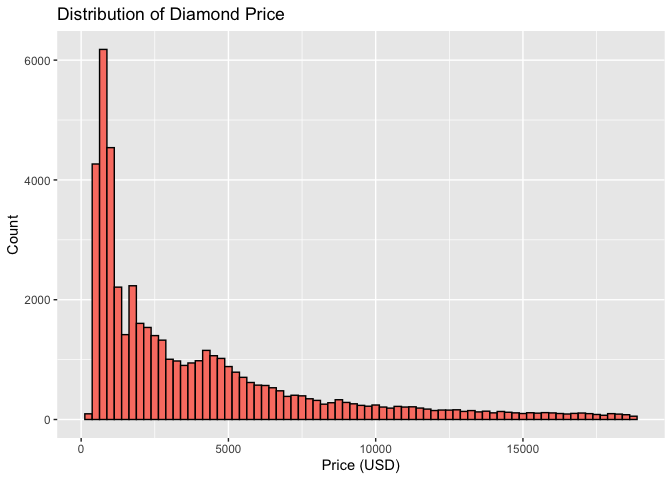<!-- -->

<u>Change 10% of Clarity Values to Missing:</u>

``` r
# Set a seed for reproducibility
set.seed(123)

# Introduce missing values in the 'clarity' column by randomly setting 10% of the values to NA
missing_indices <- sample(1:nrow(diamonds), size = 0.1 * nrow(diamonds))  # Randomly choose 10% of rows
diamonds$clarity[missing_indices] <- NA  # Assign NA to these selected rows

# Check how many missing values were introduced
sum(is.na(diamonds$clarity))  # Count the number of NA values in 'clarity'
```

    ## [1] 5394

Bar Chart of Diamon Clarities w/ Missing Values\*

``` r
ggplot(diamonds, aes(x = clarity)) +
  geom_bar(fill = "salmon", color = "black") +
  ggtitle("Bar Chart of Diamond Clarity") +
  xlab("Clarity") + ylab("Count")
```

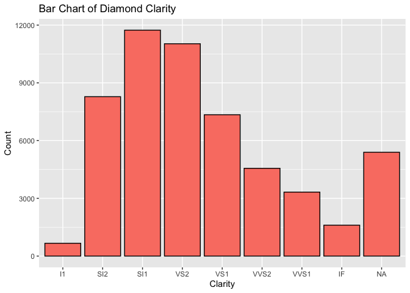<!-- -->

<u>Missing Values in a Histogram:</u>

Missing Values in a Histogram are ignored by default as a histogram is
intended to show distribution of continuous variables (and the missing
values will not fit in a bin).

<u>Missing Values in a Bar Chart:</u>

Missing Values in a Bar Chart are included under an seperate category
(ex. N/A) as seen above. Bar charts are intended to show distribution of
categorical values, and the missing values are considered an additional
category.

**2.) What does `na.rm = TRUE` do in
[`mean()`](https://rdrr.io/r/base/mean.html) and
[`sum()`](https://rdrr.io/r/base/sum.html)?**

<u>Mean() w/ missing values</u>

``` r
mean(diamonds$price) #with missing values
```

    ## [1] NA

``` r
mean(diamonds$price, na.rm = TRUE)  
```

    ## [1] 3932.103

<u>Sum() w/ Missing Values</u>

``` r
sum(diamonds$price) #with mising values
```

    ## [1] NA

``` r
sum(diamonds$price, na.rm = TRUE)  # Assuming the column is named 
```

    ## [1] 190887880

<u>Analysis for mean() and sum()</u>

In mean() and sum(), na.rm = TRUE removes any missing values present
before performing the calculations. If there are missing values, mean()
and sum() will return ‘NA’ otherwise.

**3.) Recreate the frequency plot of `scheduled_dep_time` colored by
whether the flight was cancelled or not. Also facet by the `cancelled`
variable. Experiment with different values of the `scales` variable in
the faceting function to mitigate the effect of more non-cancelled
flights than cancelled flights.**

<u>Download Flights Data and Prep:</u>

``` r
# Load necessary libraries
# Load necessary libraries
install.packages("nycflights13")
```

    ## 
    ## The downloaded binary packages are in
    ##  /var/folders/gm/rp80gh5n5xl9gv6m716w_2z00000gn/T//RtmplD27oz/downloaded_packages

``` r
library(nycflights13)
library(dplyr)
library(ggplot2)
```

<u>Recreated Frequency Plot of scheduled_dep_time (colored by
cancellation, faceted by cancelled variable, & scale variable set to
minimize effect of relative quantities)</u>

``` r
flights |> 
  mutate(
    cancelled = is.na(dep_time),  # Create a cancelled column (TRUE if dep_time is NA)
    sched_hour = sched_dep_time %/% 100,  # Extract hour from sched_dep_time
    sched_min = sched_dep_time %% 100,  # Extract minute from sched_dep_time
    sched_dep_time = sched_hour + (sched_min / 60)  # Convert to decimal time
  ) |> 
  ggplot(aes(x = sched_dep_time)) + 
  geom_freqpoly(aes(color = cancelled), binwidth = 1/4) +  # Plot frequency polygon
  facet_wrap(~cancelled, scales = "free") +  # Facet by cancelled variable
  ggtitle("Frequency of Scheduled Departure Time") +
  xlab("Scheduled Departure Time (hours)") +
  ylab("Frequency") +
  theme_minimal()
```

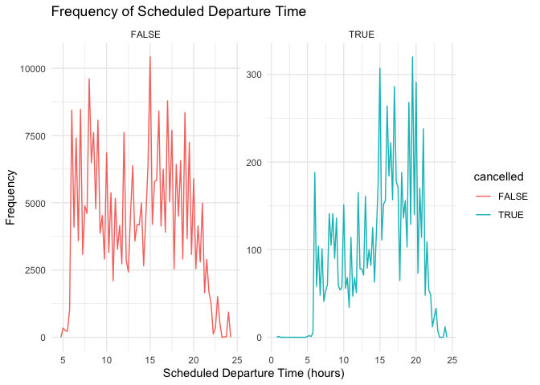<!-- -->

<u>Notes on experimenting with different scales:</u>

In order to mitigate the effect of more non-cancelled flights than
cancelled flights, the best scale variable values are “free” or
“free_y”, so that the cancelled flights scale is smaller and the charts
are visually comparable.
